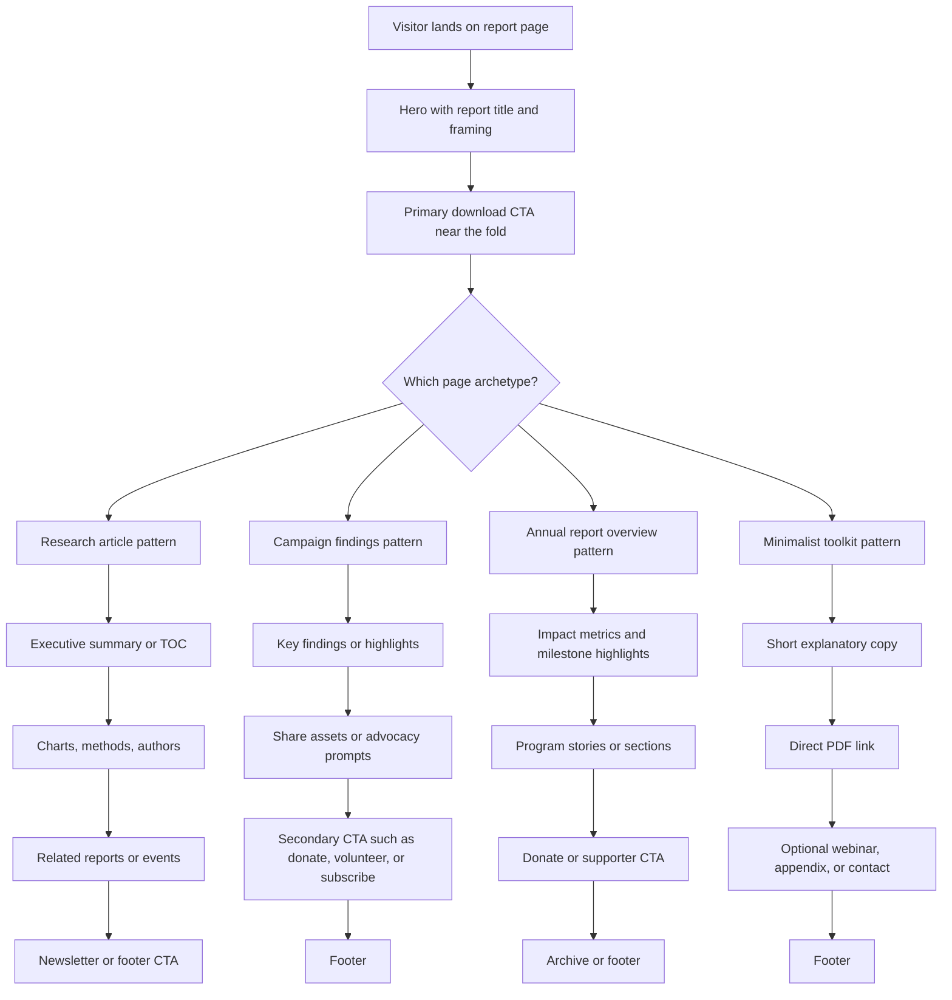

# Nonprofit Landing Pages Built Around Downloadable Reports

## Executive summary

I reviewed **12 official nonprofit examples** and, for each one, verified the landing page and opened the linked PDF where it was retrievable through the browsing interface. The strongest examples cluster into three repeatable patterns: **research-article pages** with a table of contents and executive summary, **campaign-style launch pages** organized around findings and sharing, and **annual-report overviews** that pair impact metrics with supporter-oriented secondary calls to action. Across the set, the element that is closest to universal is a **primary download CTA**. The least common elements are **multimedia**, **press/media kits**, and **robust accessibility or multilingual support**. Translation support is concentrated in Oxfam’s page, while especially strong structural navigation appears on Ada Lovelace Institute’s longform report page and NFF’s survey microsite. citeturn8view0turn15view1turn32view0turn32view2turn19view0turn15view3turn24search1turn26view1

Most of the final examples fall in the **2023–2025** window, which fits the request to prioritize recent work. One older but still instructive benchmark, **Race to Lead Revisited** from 2020, remains useful because it already exhibits a pattern now common on later nonprofit report pages: concise framing, a strong download CTA, visualized key findings, and related-news amplification. citeturn15view3turn35view1

What stands out analytically is that nonprofit landing pages for downloadable resources are rarely “just” download pages. In the best cases, the page performs four jobs at once: it **orients** the reader, **sells** the importance of the document, **extracts** one or two actions beyond downloading, and **extends** the lifespan of the report through related resources, share prompts, webinars, analyzers, event links, or donations. Pages that do only the first job tend to be much thinner and more transactional. citeturn8view0turn19view0turn15view1turn39view1turn37view0

## Curated examples

The table below focuses on **high-confidence examples** where the landing page and the PDF were both directly verified. For a few examples, the rendered capture did **not** expose a precise publication date; in those cases I mark the date as **not stated** rather than inferring it.

| Organization | Sector | Landing page | PDF or report | Publication date | One-sentence description |
|---|---|---|---|---|---|
| Nonprofit Finance Fund | Nonprofit finance / social sector | [Official page](https://nff.org/state-of-the-nonprofit-sector-survey/2025-state-of-the-survey-nonprofit-sector-survey/) | [2025 National State of the Nonprofit Sector Survey Findings](https://nff.org/wp-content/uploads/NFF-2025-Survey-Report.pdf) | 2025 | National survey findings from **2,206 nonprofits** on financial conditions, operating strain, government funding risk, and the investments needed for long-term resilience. citeturn8view0turn9view0 |
| National Council of Nonprofits | Nonprofit management / communications | [Official page](https://www.councilofnonprofits.org/articles/telling-your-story-practical-guide-nonprofits-digital-age) | [Telling Your Story: A Practical Guide for Nonprofits in the Digital Age](https://www.councilofnonprofits.org/files/media/documents/2026/telling-your-story-ncn-toolkit.pdf) | Not stated on captured page/PDF | A short toolkit arguing that nonprofits must proactively shape their own digital narratives and offering a simple storytelling framework centered on need, action, and impact. citeturn19view1turn20view1turn35view2 |
| Points of Light | Civic engagement / volunteering | [Official page](https://www.pointsoflight.org/from-nice-to-necessary-unleashing-the-impact-of-volunteering-through-transformative-investment/) | [From Nice to Necessary: Unleashing the Impact of Volunteering Through Transformative Investment](https://www.pointsoflight.org/wp-content/uploads/2025/04/Points-of-Light-From-Nice-to-Necessary-Unleashing-the-Impact-of-Volunteering-Through-Transformative-Investment.pdf) | April 2025 | A report informed by Bridgespan research arguing that volunteering is strategically essential but systematically undermeasured and underfunded, especially at the level of volunteer infrastructure. citeturn19view0turn20view0 |
| Building Movement Project | Racial equity / nonprofit leadership | [Official page](https://racetolead.org/race-to-lead-revisited/) | [Race to Lead Revisited: Obstacles and Opportunities in Addressing the Nonprofit Racial Leadership Gap](https://racetolead.org/wp-content/uploads/2020/07/RTL_Revisited_National-Report_Final.pdf) | 2020 | Based on a **2019 survey of more than 5,000 nonprofit staff**, this report examines racialized barriers to leadership, compensation, organizational culture, and the limits of DEI efforts. citeturn15view3turn35view1 |
| Ada Lovelace Institute | Technology policy / data governance | [Official page](https://www.adalovelaceinstitute.org/report/participatory-inclusive-data-stewardship/) | [Participatory and Inclusive Data Stewardship](https://www.adalovelaceinstitute.org/wp-content/uploads/pdfs/29827/participatory-and-inclusive-data-stewardship.pdf?v=1776766083) | 13 December 2024 | A landscape review of participatory and inclusive data stewardship that emphasizes legal foundations, public trust, inclusion, and the redistribution of power in data governance. citeturn15view1turn16view0 |
| Good Food Institute | Food systems / agricultural innovation | [Official page](https://gfi.org/resource/recommendations-for-president-trump-building-an-innovative-agricultural-bioeconomy/) | [Trump Administration Recommendations: Building the agricultural bioeconomy](https://gfi.org/recommendations-for-the-trump-administration-pdf) | Not stated on captured page/PDF | A policy memorandum urging federal action to expand food biomanufacturing and align agriculture, research, trade, and industrial policy around a U.S. bioeconomy strategy. citeturn15view2turn35view0 |
| Oxfam International | Economic justice / anti-poverty | [Official page](https://www.oxfam.org/en/research/inequality-inc) | [Inequality Inc.: How corporate power divides our world and the need for a new era of public action](https://oi-files-d8-prod.s3.eu-west-2.amazonaws.com/s3fs-public/2024-01/Davos%202024%20Report-%20English.pdf) | 15 January 2024 | A flagship Davos report arguing that concentrated corporate and monopoly power is intensifying inequality and that governments must redistribute power away from billionaires and dominant firms. citeturn37view0turn36view1 |
| Environmental Defense Fund | Climate policy / environment | [Official page](https://www.edf.org/report/turning-climate-commitments-results) | [Turning Climate Commitments into Results: Evaluating Updated 2023 Projections vs. State Climate Targets](https://www.edf.org/sites/default/files/2023-11/EDF-State-Emissions-Gap-December-2023.pdf) | December 2023 | An EDF analysis showing that U.S. climate-leadership states remain materially off track on their emissions commitments and identifying policy tools that could close nearly half the national gap by 2030. citeturn32view2turn36view0 |
| Western Pennsylvania Conservancy | Conservation / freshwater ecology | [Official page](https://waterlandlife.org/watershed-conservation/freshwater-mussel-conservation-plan/) | [Pennsylvania Freshwater Mussel Conservation Plan](https://wpcstaging.wpengine.com/wp-content/uploads/2026/01/Chapters1to5-Mussel-Conservation-Plan.pdf) | October 2025 | A conservation-planning resource that presents a statewide blueprint for mussel data collection, restoration, protection, and watershed-level prioritization in Pennsylvania. citeturn19view2turn35view3 |
| Atlantic Council | International development / policy | [Official page](https://www.atlanticcouncil.org/in-depth-research-reports/report/unlocking-economic-development-in-latin-america-and-the-caribbean-five-opportunities-for-private-sector-leadership-and-partnership/) | [Unlocking economic development in Latin America and the Caribbean](https://www.atlanticcouncil.org/wp-content/uploads/2023/06/AALAC_IDB_Report_060823_complete.pdf) | 26 June 2023 on page; PDF dated May 2023 | A report developed with the IDB that identifies five opportunity areas where private-sector partnerships can support inclusive, productive, and sustainable development in Latin America and the Caribbean. citeturn39view1turn41view1 |
| Environmental Defense Fund | Environment / impact reporting | [Official page](https://www.edf.org/annual-reports/2023) | [EDF Impact 2023](https://www.edf.org/sites/default/files/2023-12/EDF_IR23-Digital-Pages.pdf) | 11 December 2023 on page | EDF’s 2023 impact report highlights advances on methane, transportation, air pollution, food systems, resilience, and global climate partnerships. citeturn24search1turn25view0 |
| Native Forward Scholars Fund | Education / Indigenous student support | [Official page](https://www.nativeforward.org/annual-report-financials/) | [2024 Annual Report](https://www.nativeforward.org/wp-content/uploads/2026/01/2024_2025-Annual-Report-FINAL-compressed.pdf) | Report year 2024–2025; precise publication date not stated on captured page/PDF | An annual-report landing page focused on scholarships, academic support, and the national scale of Native Forward’s support for Native students. citeturn26view1turn27view1turn31view0 |

## Comparative feature matrix

**Legend:** **Y** = clearly present, **P** = present but limited or indirect, **N** = not evident in the rendered page capture, **Basic** = only baseline evidence visible in the rendered page capture, **ND** = not determinable from the rendered capture. “SEO/meta” is necessarily conservative here because the browsing interface exposed rendered page content more reliably than underlying metadata.

| Example | Hero / header | Cover image | Summary / exec summary | Key findings / highlights | Download CTA | Donate CTA | Email capture | Social sharing | Multimedia | Data viz / infographics | Author / acknowledgments | Related resources | Press kit / media contact | Accessibility features | Translation / language | SEO / meta evidence | Layout pattern |
|---|---:|---:|---:|---:|---:|---:|---:|---:|---:|---:|---:|---:|---:|---|---|---|---|
| NFF citeturn8view0turn9view0 | Y | Y | Y | Y | Y | Y | Y | P | Y | P | P | Y | N | Basic | N | Basic | Campaign-style survey microsite |
| NCN citeturn19view1turn20view1 | Y | Y | Y | N | Y | N | N | N | N | N | N | N | N | Basic | N | Basic | Short article plus direct PDF |
| Points of Light citeturn19view0turn20view0 | Y | Y | Y | Y | Y | N | N | Y | N | N | N | N | P | Basic | N | Basic | Campaign launch page with sharing assets |
| Building Movement Project citeturn15view3turn16view2 | Y | P | Y | Y | Y | N | N | P | N | Y | P | Y | N | Basic | N | Basic | Findings page with download and amplification |
| Ada Lovelace Institute citeturn15view1turn16view0 | Y | Y | Y | N | Y | N | N | N | N | N | Y | P | N | Strong | N | Basic | Longform research article with chapter nav |
| Good Food Institute citeturn15view2turn16view1 | Y | Y | Y | N | Y | Y | N | Y | N | N | N | N | N | Basic | N | Basic | Advocacy memo page |
| Oxfam International citeturn37view0turn36view1 | Y | N | Y | N | Y | Y | Y | Y | N | N | Y | N | N | Basic | Y | Basic | Download-first policy page |
| EDF climate report citeturn32view2turn36view0 | Y | P | Y | N | Y | N | N | Y | N | Y | N | N | N | Basic | N | Basic | Research explainer plus PDF |
| Western Pennsylvania Conservancy citeturn19view2turn35view3 | Y | P | Y | N | Y | Y | N | Y | Y | Y | N | P | N | Basic | N | Basic | Table-of-contents portal for report suite |
| Atlantic Council citeturn39view1turn41view1 | Y | Y | Y | N | Y | P | Y | P | N | Y | Y | Y | Y | Basic | N | Basic | Longform report page with media toolkit |
| EDF Impact 2023 citeturn24search1turn25view0 | Y | Y | Y | Y | N | N | N | Y | N | N | N | Y | N | Basic | N | Basic | Interactive annual-report landing page |
| Native Forward citeturn26view1turn27view1turn31view0 | P | P | Y | Y | Y | Y | N | N | N | Y | N | N | N | Basic | N | Basic | Annual-report overview with donor framing |

## Cross-example analysis

The most stable design pattern is the **hero-first orientation layer**. Even pages that are otherwise sparse almost always begin with a strong report title, a short framing sentence or paragraph, and a download prompt positioned close to the top of the content stack. Where the page is more fully developed, that hero block is reinforced by a cover image, lead illustration, or impact image. NFF, Ada, GFI, Atlantic Council, Points of Light, and EDF’s report pages all follow this principle, albeit with different levels of visual ambition. citeturn8view0turn15view1turn15view2turn39view1turn19view0turn32view2turn24search1

A second strong pattern is the division between **summary-led** pages and **findings-led** pages. Summary-led pages behave more like digital coversheets for a serious report: they foreground an executive summary, chapter navigation, or structured introduction and presume a reader willing to spend time before downloading. Ada Lovelace Institute and Atlantic Council are the clearest examples. Findings-led pages, by contrast, are optimized for fast scanning, amplification, and advocacy. NFF, Points of Light, and Race to Lead Revisited foreground bullet findings, pull-outs, or key-finding graphics before the user ever reaches related materials or footer CTAs. citeturn15view1turn39view1turn8view0turn19view0turn15view3

CTA strategy maps closely to organizational type. **Research and policy nonprofits** tend to center the download itself, then add related reports, methodology, or citations as secondary paths; this is visible on Ada, Atlantic Council, EDF’s state-climate report page, and Oxfam. **Membership, capacity-building, and donor-facing nonprofits** are more likely to layer in separate asks such as donate, subscribe, volunteer, or “join the movement.” NFF adds donation and email signup beneath the report content; Oxfam pairs downloads with newsletter signup and donate prompts; Native Forward surrounds its annual-report overview with giving language; Points of Light turns the report into a volunteer-mobilization and partnership page. citeturn15view1turn39view1turn32view2turn37view0turn8view0turn26view1turn19view0

**Email capture** and **social sharing** are common but not universal, and they tend to signal whether the organization views the page as a marketing asset rather than merely a publication page. Oxfam, NFF, Atlantic Council, and NPT-style pages use email signup prominently; Points of Light and Oxfam explicitly include share assets or share controls; GFI and EDF’s report pages use more standard share buttons. By contrast, the leanest examples, such as the National Council of Nonprofits toolkit page, are notably more transactional: short lead, direct PDF, minimal extension architecture. citeturn37view0turn8view0turn39view1turn19view0turn15view2turn21view0turn19view1

**Multimedia is the exception**, not the norm. In this final set, the clearest cases are NFF’s embedded webinar/recording support and Western Pennsylvania Conservancy’s use of interactive maps alongside downloadable plan materials. Most of the other pages remain firmly document-centric, even when the underlying PDF contains charts, illustrations, or photography. This suggests that for nonprofits, the “resource landing page” is still primarily a **distribution and framing mechanism**, not usually a multimedia storytelling destination. citeturn8view0turn19view2

**Data visualization and infographic treatment** appear most often on pages tied to survey work, annual reports, or policy benchmarking. NFF uses findings modules and an analyzer; Race to Lead places key-finding images at the center of the page; NPT’s annual report page foregrounds repeated grantmaking metrics; EDF’s climate report page embeds a key graph right below the download prompt; Atlantic Council uses multiple images in support of the report narrative. Where these elements are absent, the page more often functions as a clean wrapper around the downloadable PDF rather than as a substantive preview of the analysis. citeturn8view0turn15view3turn26view0turn32view2turn39view1

**Accessibility and multilingual support are uneven.** Oxfam is the strongest language example in this set, with page-level language options and multiple download variants. Ada’s page is especially strong structurally, offering chapter navigation and an explicit “How to read this paper” section that improves information scent for long documents. Many other pages show only baseline accessibility signals in the rendered capture, such as skip links, alt-text exposure, and hierarchical headings. That pattern suggests that while nonprofits are increasingly sophisticated about report marketing, **accessibility maturity varies much more than visual polish does**. citeturn37view0turn15view1turn8view0turn26view2

On **SEO/meta elements**, the rendered captures consistently exposed strong visible signals—descriptive H1s, meaningful page titles, breadcrumbs, and section headings—but did not reliably expose deeper metadata or structured-data implementations. Even with that constraint, the practical conclusion is clear: the better-performing pages are the ones that behave like **indexable, self-explanatory resources** rather than bare attachment gateways. Oxfam, Atlantic Council, Ada, NFF, and EDF’s report pages are especially legible in this respect because the page itself communicates topic, thesis, format, and next actions before the user touches the PDF. citeturn37view0turn39view1turn15view1turn8view0turn32view2

## Common layout patterns

The examples above reduce to a small handful of recurring information architectures:

In plain terms, nonprofits seem to make an early decision about whether the landing page should function mainly as a **publication wrapper**, an **advocacy amplifier**, or a **supporter-facing impact surface**. That decision then predicts most downstream choices about findings modules, email capture, donation prompts, related-resource blocks, and whether the page tries to stand on its own independent of the PDF. citeturn15view1turn19view0turn8view0turn24search1turn19view1

## Open questions and limitations

This final set is intentionally conservative. I excluded otherwise-relevant candidates when the landing page was available but the linked PDF could not be fetched safely or directly through the browsing interface, or when the page was more of an archive/index than a dedicated resource page.

For a small number of included examples, the captured page/PDF did **not** expose a precise publication date. I preserved that uncertainty rather than inferring a date from URLs or filenames.

The browsing interface used here reliably supported opening pages and PDFs, but it did **not** provide a dependable way to embed literal webpage screenshots in the final answer. As a result, the visual analysis above is grounded in rendered page structure, visible image references, and verified PDF covers/content rather than literal webpage screenshots.